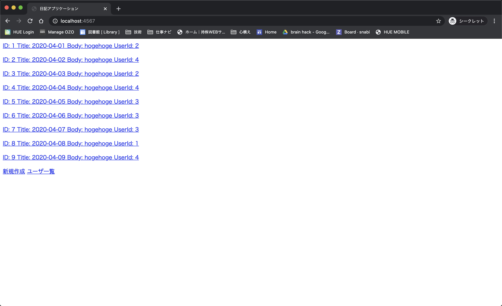
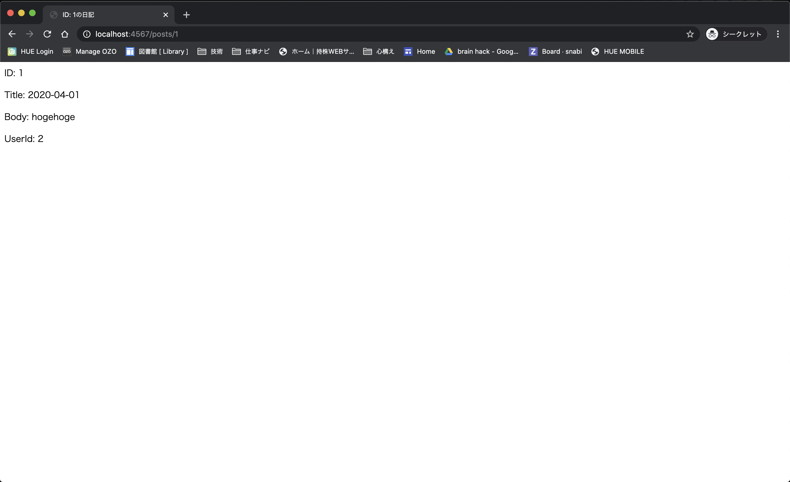
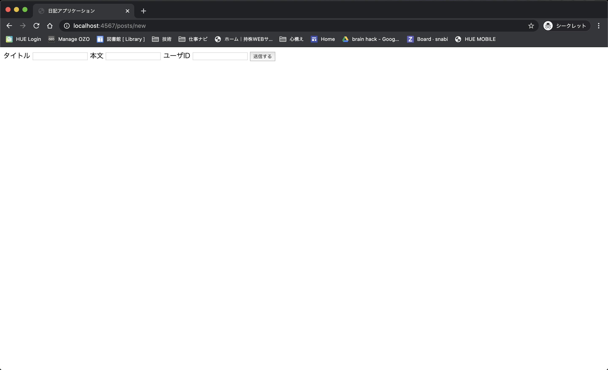
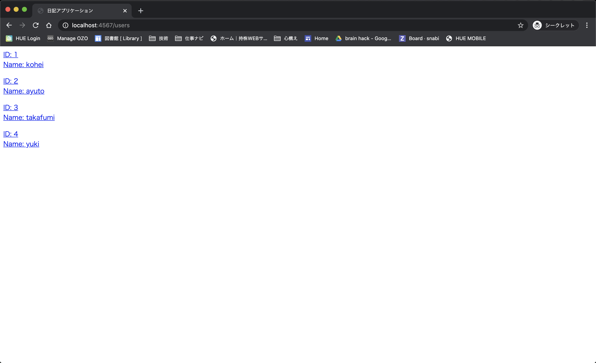
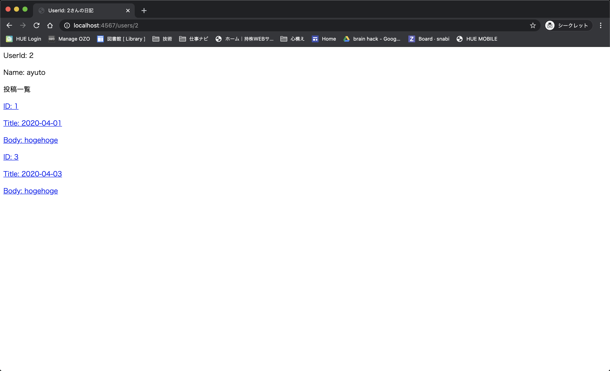

# start project
```bash
$ docker-compose up -d
$ docker-compose exec app ruby init.rb
# ブラウザでlocalhost:4567へアクセスする。
```
# モック
| サイトトップ兼投稿一覧                               | 投稿詳細                               | 投稿作成                               | ユーザ一覧                               | ユーザ詳細                             |
| ---------------------------------------------------- | -------------------------------------- | -------------------------------------- | ---------------------------------------- | -------------------------------------- |
|  |  |  |  |  |
